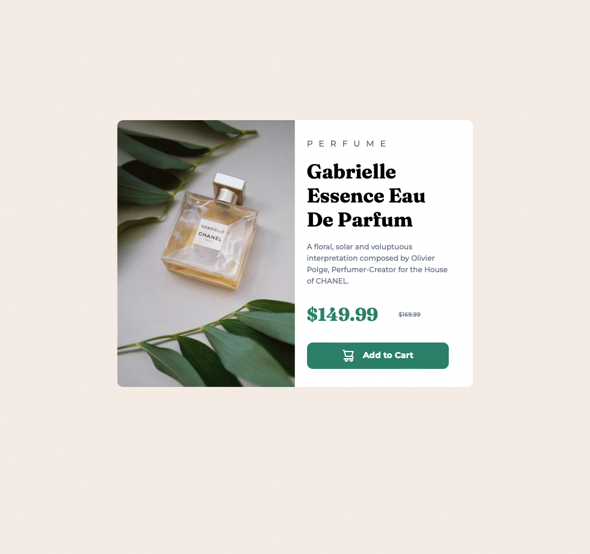

# Frontend Mentor - Product preview card component by Matias Frascino

This is a solution to the [Product preview card component challenge on Frontend Mentor](https://www.frontendmentor.io/challenges/product-preview-card-component-GO7UmttRfa). Frontend Mentor challenges help you improve your coding skills by building realistic projects. 

## Table of contents

- [Overview](#overview)
  - [Screenshot](#screenshot)
  - [Links](#links)
- [My process](#my-process)
  - [Built with](#built-with)
- [Author](#author)

## Overview
This is a project in which I created a responsive card to showcase a product (in this case, a perfume) following the predefined styles.

### Screenshot

### Links

- Solution URL: [https://github.com/MatiasFrascino/product-preview](https://matiasfrascino.github.io/product-preview/)
- Live Site URL: [https://matiasfrascino.github.io/qr-code-component/](https://matiasfrascino.github.io/product-preview/)

## My process

### Built with

- Semantic HTML5 markup
- CSS custom properties
- Flexbox
- Mobile-first workflow

## Author

- GitHub - [Matias Frascino](https://github.com/MatiasFrascino)
- Frontend Mentor - [@MatiasFrascino](https://www.frontendmentor.io/profile/MatiasFrascino)
- Linkedin - [Matias Frascino](https://www.linkedin.com/in/matias-sebastian-frascino-60332316b/)
